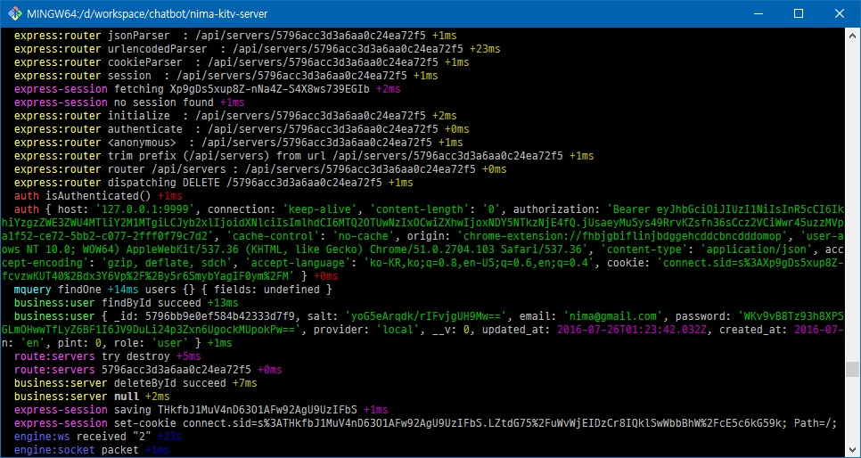

### debug 모듈 사용법

-----

특정 단어와 정보를 나타내는 모듈, 개발 중 이벤트를 추려서 볼 수 있다.

https://www.npmjs.com/package/debug

-----

#### Step 0 - 모듈 설치
```bash
npm install --save debug
typings install --save --global dt~debug
```
-----

#### Step 1 - 코드 생성
logger.ts
```typescript
/** Logging */
export const DEBUG: string = 'debug';

export const DEBUG_ROUTE_SERVERS: string = 'route:servers';
export const DEBUG_ROUTE_USERS: string = 'route:users';

export const DEBUG_MODEL_USER: string = 'model:user';
export const DEBUG_MODEL_SERVER: string = 'model:server';

export const DEBUG_DB_EVENT_COMMON: string = 'db:event:common';
export const DEBUG_DB_EVENT_SERVER: string = 'db:event:server';

export const DEBUG_UTIL_REQUEST: string = 'util:request';
export const DEBUG_UTIL_PASSPORT: string = 'util:passport';
```

worker.ts
```typescript
import {DEBUG_MODEL_USER} from '../../config/logger';
import * as debugClass from 'debug';
let debug: debug.IDebugger = debugClass(DEBUG_MODEL_USER);

debug(`프린트 되는 내용은 model:user + 메시지 입니다.`)
```

#### Step 2 - 테스트
windows
```bash
set DEBUG=*
node app.js
```

linux
```bash
DEBUG=* node app.js
```

server 또는 user 가 포함된 내용을 볼 경우
```bash
set DEBUG=*server*,*user*
node app.js
```

#### Step 3 - 예시

