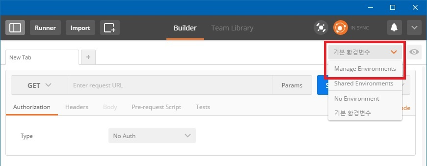
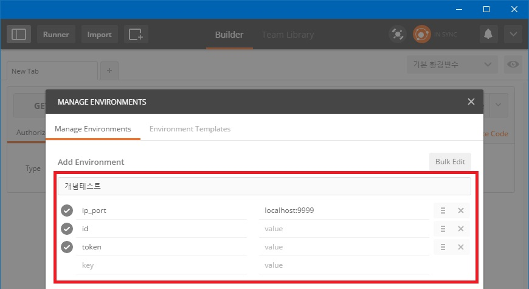
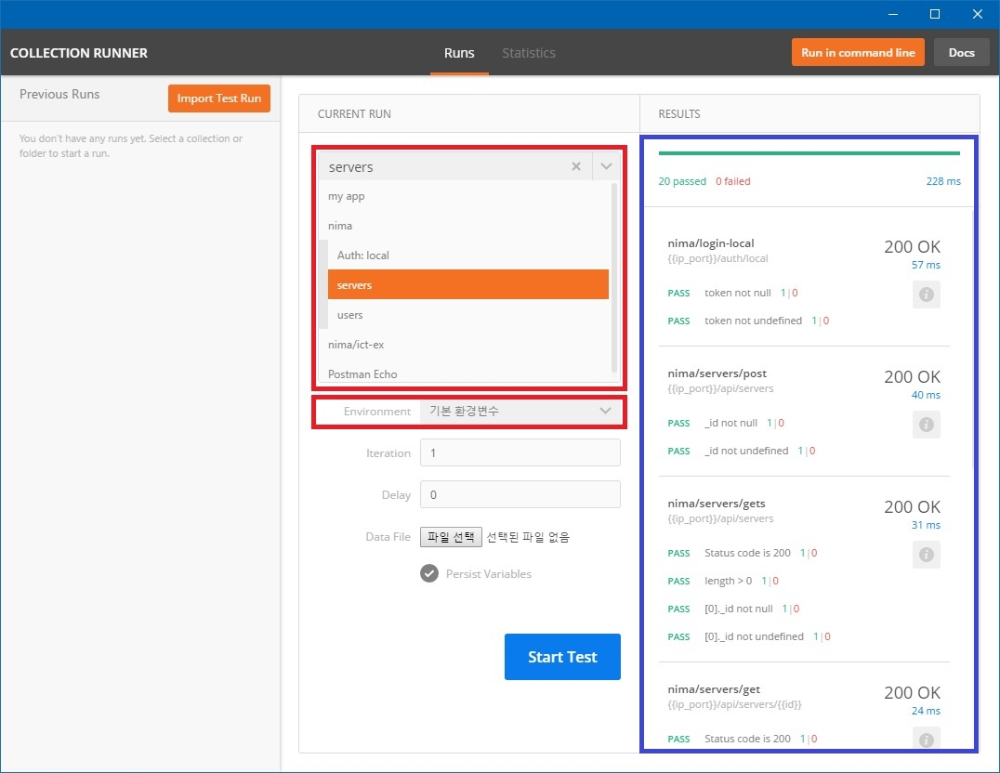

## postman
### REST 통신관련 툴

#### Step 0 - 설치
1. google chrome app 검색 후, 설치
2. app 실행
3. 계정 등록

#### Step 1 - 환경변수 등록

##### Setting
- ip_port : 테스트 ip & port (예시: localhost:9999)
- id : REST 통신에서 get, delete, update 등에서 사용할 변수
- token : 인증에 사용할 변수

##### 환경변수 등록 1


##### 환경변수 등록 2


#### Step 2 - REST 등록
1. uri 입력
2. header 입력
3. body 입력 (post 의 경우)
4. test 입력

##### uri 입력
1. REST Type 선택 (GET, POST)
2. uri  & params 입력 : {{ip_port}}/`route 경로`
  - post와 같이 id를 사용하지 않는 경우 : {{ip_port}}/`route 경로`
  - id 를 기준으로 하는 경우 (get, delete 등) : {{ip_port}}/`route 경로`/{{id}}

##### HEADER 설정
1. 인증 사용 시
  - key: Authorization
  - value: Bearer {{token}}

##### BODY 설정
- JSON 사용 시
  1. raw 선택
  2. raw 타입 목록에서 JSON 선택 (기본 Text로 표시되어 있음)
  3. JSON 입력

##### TEST 설정
- Environment 값을 갱신
```javascript
var jsonData = JSON.parse(responseBody);
postman.setEnvironmentVariable("token", jsonData.token);
postman.setEnvironmentVariable("id", jsonData._id);
```

- Test
```javascript
var jsonData = JSON.parse(responseBody);
tests["Status code is 200"] = responseCode.code === 200;
tests["length > 0"] = jsonData.length > 0;
tests["[0]._id not null"] = jsonData[0]._id !== null;
tests["[0]._id not undefined"] = jsonData[0]._id !== undefined;
```

#### Step 3 - 묶음 테스트
- Collection 또는 Folder를 선택하면 내부의 모든 내용을 테스트한다.

1. Postman Runner 실행
2. CURRENT RUN 에서 테스트 목록 또는 대상 선택
3. Environment 에서 관련 설정 값 선택
4. Start Test
5. RESULT 에서 결과값 확인

##### 화면예시
